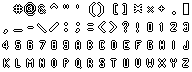
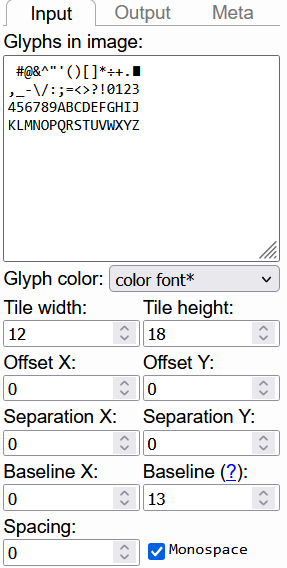
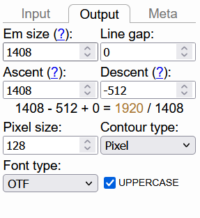

# Betaflight Default Font OTF

Tool used to create this font: [YAL's Pixel Font Converter!](https://yal.cc/tools/pixel-font/)



## Settings

```
 #@&^"'()[]*%+.∎
,_-\/:;=<>?!0123
456789ABCDEFGHIJ
KLMNOPQRSTUVWXYZ
```



